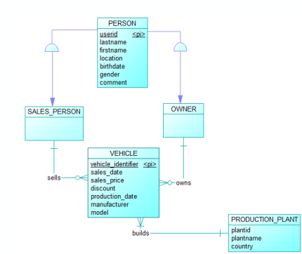

# Erstellen der gewöhnlichen Architektur

## Beispielarchitektur

Um das Star Schema zu demonstrieren soll die folgende, zu vereinfachende Architektur der Datenbank eines Fahrzeugverkaufs als ein Beispiel dienen:

Hier werden die verkauften Fahrzeuge, ihre Käufer und Verkäufer, sowie ihr Produktionswerk gespeichert.

Die Tabellen liegen in der 3. Normalform vor. Eine Besonderheit ist, dass die Tabelle `Personen` sowohl für Kaufende und Verkaufende verwendet wird. Sie ist daher durch zwei Verbindungstabellen mit den verkauften Fahrzeugen verbunden.

## Erstellen der Beispielarchitektur

Im rechten Terminal wird ein Container geöffnet, in dem die Datenbank PostgreSQL installiert ist. Der Container enthält des weiteren ein Script, das eine Umsetzung der Tabellen ermöglicht, sowie einen Ordner mit generierten Beispieldaten.

Mit dem Befehl `psql -f structural_model.sql`{{execute}} werden die Tabellen angelegt und mit Beispieldaten aus dem `/mock_data` Verzeichnis gefüllt.

Mit `psql`{{execute}} kann anschließend die Kommandozeile der Datenbank aufgerufen werden, um mit `\d` zu überprüfen, ob die Tabellen erstellt wurden.
