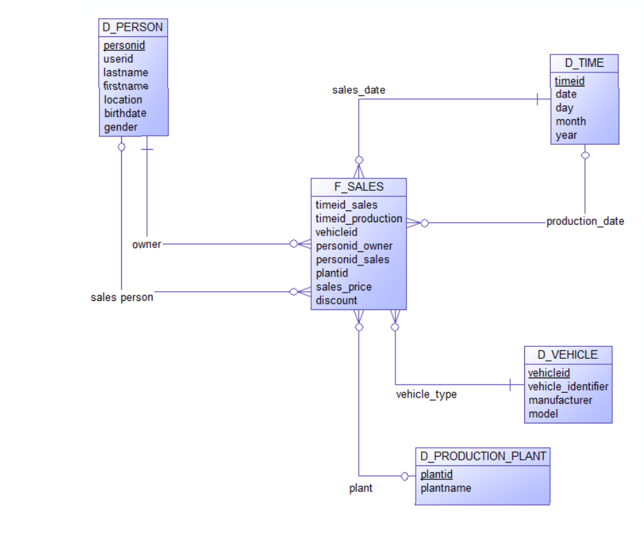

## Remodellierung 

Wendet man das Star Schema auf das bisherige Beispiel an, könnte man die Fahrzeugverkäufe in eine Fact-Tabelle unterbringen. Jeder Verkauf verknüpft Fahrzeug, Personen und Produktionsstätte miteinander. Außerdem ist es möglich, die Angaben zu Baujahr und Verkaufsdatum in einer separaten Dimension-Tabelle abzukapseln, um die Fact-Tabelle zu entlasten und doppelte Datumsangaben nur einmal speichern zu müssen. Dabei ist zu beachten, dass das Baujahr dadurch nicht mehr Attribut des Fahrzeugs bleibt, sondern durch die Fact-Tabelle mit dem Fahrzeug verbunden wird.

Die folgende Abbildung zeigt den Aufbau der Beispieldatenbank unter Berücksichtigung des Star Schemas.



Wie zu sehen ist, wurde durch die Remodellierung die maximale Join-Tiefe von 2 auf 1 gesenkt, da jede Dimension-Tabelle direkt mit der Fact-Tabelle verbunden ist. Bei größeren Tabellen mit einer höheren ursprünglichen Join-Tiefe ist dieser Unterschied natürlich markanter als bei dem Beispiel.

Die folgende Befehlfolge erstellt die Tabellen, die im Star Schema enthalten sind:

```
CREATE TABLE D_Persons (
    personid SERIAL PRIMARY KEY,
    userid INT NOT NULL,
    lastname VARCHAR(32) NOT NULL,
    firstname VARCHAR(32) NOT NULL,
    location VARCHAR(64),
    birthday DATE,
    gender CHAR(1) NOT NULL,
    comment VARCHAR(100)
);

CREATE TABLE D_Vehicles (
    vehicleid SERIAL PRIMARY KEY,
    vehicle_identifier INT NOT NULL,
    model VARCHAR(5)
);

CREATE TABLE D_Production_Plants (
    plantid SERIAL PRIMARY KEY,
    plantname VARCHAR(32),
    country VARCHAR(32)
);

CREATE TABLE D_Times (
    timeid SERIAL PRIMARY KEY,
    date DATE NOT NULL,
    day INT NOT NULL,
    month INT NOT NULL,
    year INT NOT NULL
);

CREATE TABLE F_Sales (
    timeid_sales INT REFERENCES D_Times(timeid),
    timeid_production INT REFERENCES D_Times(timeid),
    vehicleid INT REFERENCES D_Vehicles(vehicleid),
    personid_owner INT REFERENCES D_Persons(personid),
    personid_sales INT REFERENCES D_Persons(personid),
    plantid INT REFERENCES D_Production_Plants(plantid),
    sales_price FLOAT NOT NULL,
    discount FLOAT NOT NULL
);
```{{execute}}

